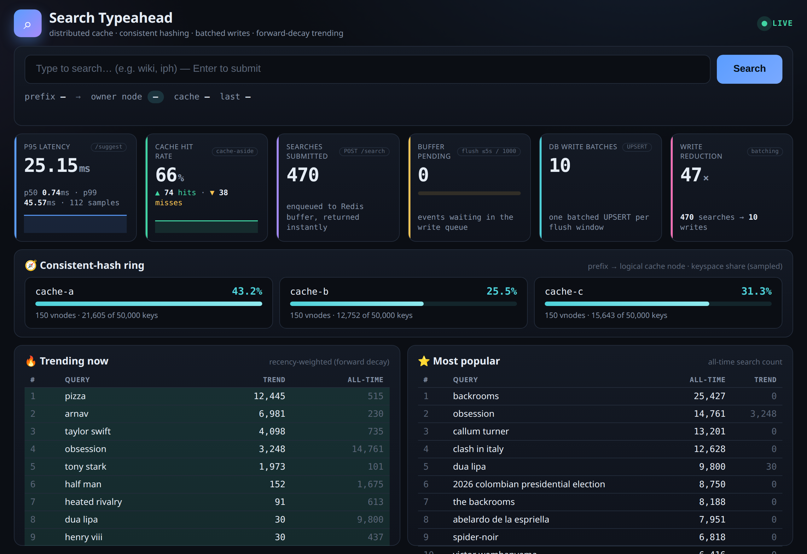
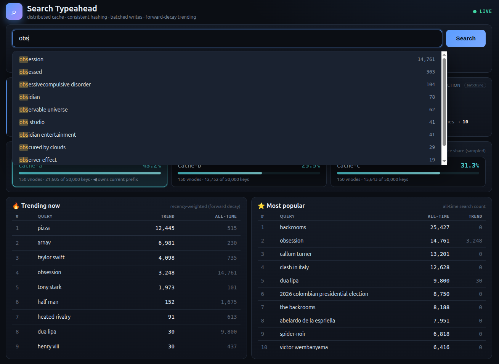
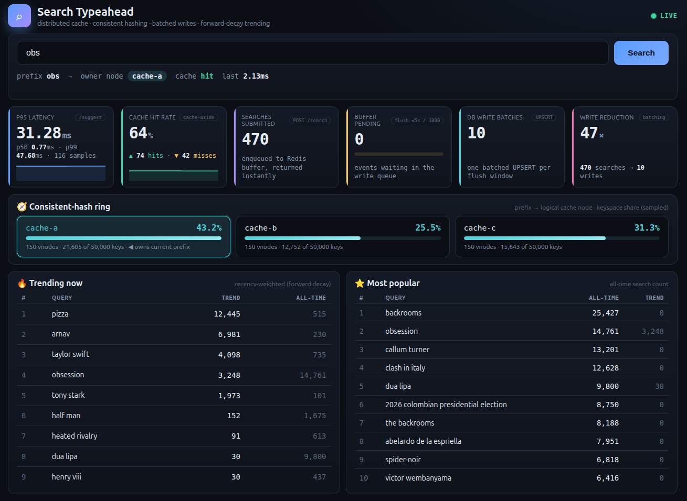
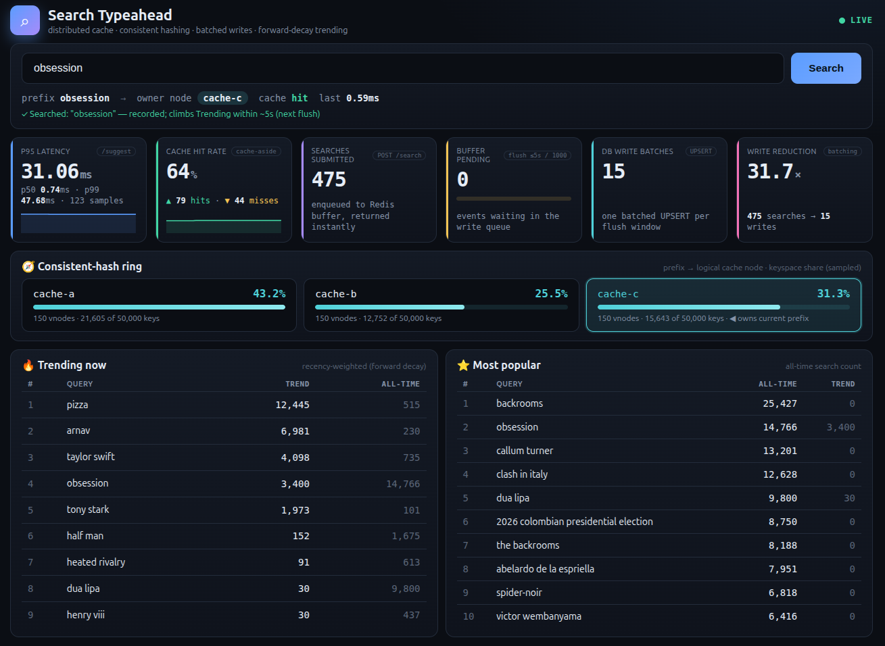
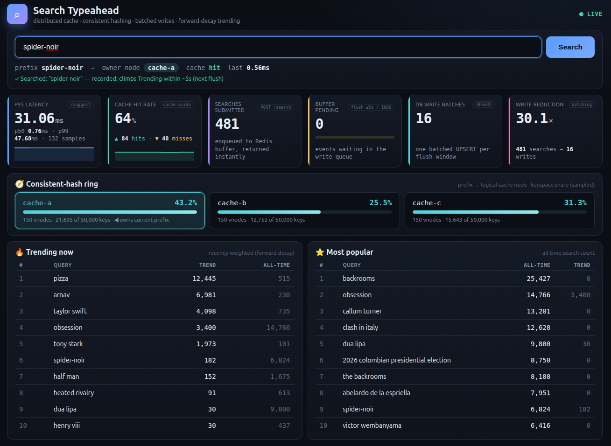

# Search Typeahead System

A search-as-you-type system that suggests popular queries by **prefix**, ranked
either by all-time popularity or by **recency-aware trending**, served through a
**distributed cache** partitioned with **consistent hashing**, and fed by a
**batched write pipeline** so the primary database is never written to
synchronously on a search. Ships with a live **metrics dashboard**.

> This README maps directly to the assignment's *Expected Submission* checklist.
> For the deep design rationale (every decision, the trending formula, the hash
> ring, batching internals, how each metric is computed, worker responsibilities)
> see **[NOTES.md](NOTES.md)**.

---

## Table of contents
1. [Setup & run instructions](#1-setup--run-instructions)
2. [Dataset source & loading](#2-dataset-source--loading)
3. [Architecture](#3-architecture)
4. [API documentation](#4-api-documentation)
5. [Screenshots](#5-screenshots)
6. [Performance report](#6-performance-report)
7. [Design choices & trade-offs](#7-design-choices--trade-offs)
8. [Repository layout](#8-repository-layout)

---

## 1. Setup & run instructions

**Requirements:** Docker + Docker Compose. Nothing else (Node, Postgres, Redis
all run in containers).

```bash
# 1. Build & start the whole stack: nginx + 3 app replicas + Postgres + Redis + worker
docker compose up -d --build

# 2. Seed the queries table from queries.csv (~718k rows via COPY). One-shot.
docker compose run --rm seed

# 3. Open the dashboard
open http://localhost:8080            # (or just visit it in a browser)
```

Liveness check: `curl localhost:8080/health` → `{"status":"ok","postgres":true,"redis":true}`

**Try it:**
- Type a prefix (e.g. `wik`, `iph`) → suggestions appear; the routing line shows
  which logical cache node owns the prefix and hit/miss; the ring panel
  highlights that node.
- Press **Enter** a few times on a query → it climbs the **Trending** board
  within ~5s (one flush), the **Buffer pending** gauge spikes then drains,
  **Searches submitted** rises, and **Cache hit rate** climbs (repeats hit).

**Optional — load test (batch-write evidence at volume):**
```bash
# Replays search_events.csv (~500k events) through POST /search and prints the
# write-reduction number. Preserves original timestamps for recency weighting.
docker compose run --rm loadtest
```

**Optional — consistent-hashing demo (even distribution + partial remap):**
```bash
docker compose exec worker npm run demo-hash
```

**Tunables** (defaults are sensible; override in `.env` or compose):
`DECAY_FACTOR` (0.85), `DECAY_EPOCH` (2026-06-01), `CACHE_TTL_SECONDS` (300),
`FLUSH_INTERVAL_MS` (5000), `FLUSH_MAX_BATCH` (1000), `CACHE_NODES`
(`cache-a,cache-b,cache-c`), `VNODES_PER_NODE` (150). See
[app/src/config.js](app/src/config.js) — every constant is documented there.

---

## 2. Dataset source & loading

| File | What it is | How it's used |
|---|---|---|
| `reference/queries.csv` | `query,count` — ~718k rows, real aggregated **Wikipedia pageview** traffic | Bulk-loaded into the `queries` table to seed `all_time_count` |
| `reference/search_events.csv` | `query,timestamp` — ~500k synthetic search events over 30 days | Replayed **on demand** by `load_test.js` through `POST /search` to exercise the batch pipeline; not loaded at startup |

**Loading** ([app/scripts/load.js](app/scripts/load.js)): the 718k rows are
streamed into an `UNLOGGED` staging table with Postgres **`COPY`** (seconds, not
the minutes a row-by-row insert would take), then one set-based
`INSERT … SELECT … GROUP BY … ON CONFLICT DO UPDATE` populates `queries`.
`all_time_count = count`; `trending_score` starts at `0` (a query only trends
once it's actually searched).

---

## 3. Architecture

```
                       ┌────────────────┐
        browser ──────▶│   nginx  (LB)   │   round-robin over replicas
                       └───────┬─────────┘
            ┌──────────────────┼──────────────────┐
       ┌────▼────┐        ┌────▼────┐        ┌────▼────┐
       │  app1   │        │  app2   │        │  app3   │   Node/Express (ESM), STATELESS
       └────┬────┘        └────┬────┘        └────┬────┘
            │  GET /suggest  → cache-aside read path
            │  POST /search  → enqueue to buffer, return immediately
   ┌────────▼─────────────────────────────────────────┐
   │ Redis                                             │
   │  • cache: ZSET per (logicalNode, mode, prefix)    │  consistent-hash ring routes
   │           key = cache:<node>:suggest:<mode>:<pfx> │  prefix → logical node
   │  • write buffer: LIST  (search:queue)             │  POST /search RPUSHes here
   │  • metric counters + p95 latency window           │  shared across all processes
   └────────┬───────────────────────────────▲─────────┘
            │ on miss: read PG, repopulate    │ drains queue, aggregates,
            │ ZSET, set TTL                   │ ONE batched UPSERT per flush
   ┌────────▼───────────────────────┐   ┌────┴───────────────────────────┐
   │ PostgreSQL — source of truth    │◀──│ worker                          │
   │  queries(query, all_time_count, │   │  • flusher (time/size trigger)  │
   │          trending_score, …)     │   │  • decay reconciliation loop    │
   │  daily_search_counts(query,     │   └─────────────────────────────────┘
   │          day_bucket, count)     │
   └─────────────────────────────────┘
```

- **nginx** load-balances (round-robin) across **3 stateless app replicas**.
- **app replicas** hold no state — all shared state is in Postgres (truth) and
  Redis (cache + queue + metrics), so they scale horizontally.
- **Redis** plays three roles: the distributed cache (ZSETs, partitioned across
  logical nodes by a hand-written consistent-hash ring), the write-buffer queue
  (a LIST), and shared metric counters.
- **PostgreSQL** is the source of truth (two tables).
- **worker** runs the flusher (drains the buffer → batched UPSERTs) and a decay
  reconciliation loop.

Full reasoning for every box and arrow is in **[NOTES.md](NOTES.md)**.

---

## 4. API documentation

| Method | Path | Behavior |
|---|---|---|
| `GET` | `/suggest?q=<prefix>&mode=basic\|trending` | Up to 10 prefix matches, sorted by `all_time_count` (basic, default) or `trending_score` (trending). Cache-aside through Redis. Empty/missing/no-match → `{suggestions: []}`, never an error. Returns `cache.hit`, `cache.node`, `latency_ms`. |
| `POST` | `/search` | Body `{"query":"…"}` (optional `ts` ISO string for the replayer). **Enqueues** to the Redis buffer and returns `{"message":"Searched","query":"…"}` immediately — never blocks on Postgres. |
| `GET` | `/cache/debug?prefix=<p>` | Which logical node owns the prefix (via the ring) + current hit/miss per mode + ring node list. |
| `GET` | `/cache/ring?sample=N` | Sampled keyspace distribution across logical nodes (powers the dashboard ring panel). |
| `GET` | `/trending?limit=10` | Top trending queries overall (not prefix-scoped). |
| `GET` | `/top?limit=10` | Both leaderboards in one call: `{trending, popular}` (by `trending_score` and `all_time_count`). Backs the two dashboard tables. Uncached → always fresh. |
| `GET` | `/stats` | Cache hit rate, Postgres read/write counts, **write-reduction factor**, p50/p95/p99 `/suggest` latency, live write-queue depth, ring info. |
| `POST` | `/stats/reset` | Reset counters (demo convenience). |
| `GET` | `/health` | Postgres + Redis liveness. |

Example:
```bash
curl 'localhost:8080/suggest?q=wik&mode=basic'
# {"query":"wik","mode":"basic","count":10,"cache":{"hit":false,"node":"cache-b"},
#  "latency_ms":12.3,"suggestions":[{"query":"wikipedia","score":1067}, …]}
```

---

## 5. Screenshots

The whole UI is self-contained vanilla HTML/CSS/JS (no framework, no CDNs) served
by the app, and fits one screen at any window height (height-responsive layout).

**Full dashboard** — search + routing, six live metric cards, consistent-hash
ring with keyspace distribution, and the trending/popular leaderboards:



**Typeahead dropdown** — prefix-matched suggestions ranked by count, matched
prefix highlighted, updated as you type (debounced):



**Cache routing & hit** — after searching `obs`, the routing line shows the
prefix mapped to logical node `cache-a` with a **cache hit** in `2.13ms`; the
consistent-hash ring highlights `cache-a` as the owner:



**Trending climb** — searching `obsession` (owned by `cache-c`) records it and it
rises in the Trending board; note **DB write batches = 15** for **475 searches**
(write reduction ≈ 31×), and the ring now highlights `cache-c`:



**Consistent-hash routing to a different node** — `spider-noir` routes to
`cache-a` and, after searching, enters the Trending top-10 (#6) while its
all-time rank stays low — the recency-vs-popularity difference, live:



---

## 6. Performance report

Measured on this machine via `GET /stats` and the helper scripts (your hardware
will vary; the *ratios* are the point).

**Latency** (`/suggest`, rolling p95 over the last 1000 requests):
- **Cache hit**: ~0.7–1 ms (Redis `ZREVRANGE`, no Postgres).
- **Cache miss**: one indexed prefix scan in Postgres + repopulate; p95 ≈ 20–30 ms cold.
- The `query text_pattern_ops` index turns `LIKE 'prefix%'` into an index range
  scan (verified with `EXPLAIN`: `Index Cond: query ~>=~ 'iph' AND query ~<~ 'ipi'`).

**Cache hit rate**: climbs as prefixes are re-read; repeated identical searches
hit because the cache is TTL-bounded (not evicted on every write). Reported live
on the dashboard and in `/stats`.

**Write reduction through batching** (from `docker compose run --rm loadtest`):

| Raw `POST /search` submissions | Postgres write batches | Reduction |
|---|---|---|
| **500,000** | **669** | **≈ 747× fewer writes** |

i.e. half a million searches collapsed into 669 batched `UPSERT` transactions.

**Consistent hashing** (`npm run demo-hash`):
- Removing 1 of 3 nodes remaps **~33%** of keys (only the leaving node's share)
  vs **~67%** for naïve `hash % N`; re-adding restores 100% (deterministic).
- Keyspace distribution with 150 virtual nodes ≈ 43% / 25% / 31% across the
  three nodes (finite-vnode variance; more vnodes → tighter).

---

## 7. Design choices & trade-offs

Summary here; **[NOTES.md](NOTES.md)** has the full reasoning for each.

- **Two counters, never one.** `all_time_count` is monotonic and never decayed
  (basic mode); `trending_score` is a recency-weighted accumulator (trending
  mode). Same `/suggest` API, different `ORDER BY`.
- **Forward exponential decay for trending.** Each search adds
  `(1/DECAY)^(day − epoch)` to `trending_score`; ranking by it equals ranking by
  exponentially-decayed recent counts, so trending updates **at write time** with
  a plain `ORDER BY` — no full-table decay sweep. (Formula & proof in NOTES.)
- **Batch at the Postgres boundary.** `POST /search` only pushes to a Redis LIST
  and returns; one worker drains, aggregates, and issues a single batched
  `UPSERT` per flush (time-OR-size trigger).
- **Cache-aside, TTL-bounded freshness.** ZSET cache values; reads recompute on
  miss and repopulate with a TTL. We do **not** evict on every write (that keeps
  hot prefixes cold and kills the hit rate); the live `/top` board is uncached so
  trending still updates instantly.
- **Consistent hashing from scratch** with virtual nodes maps prefix → logical
  cache node, so adding/removing a node remaps only ~1/N of keys.
- **Consistency/latency trade-off (deliberate):** counts may lag by up to one
  flush interval (writes) or one TTL window (reads). A crash before a flush loses
  that window's increments. Accepted — this is trending *direction*, not
  financial accounting.

---

## 8. Repository layout

```
docker-compose.yml            full stack (nginx, 3 app replicas, postgres, redis, worker, + seed/loadtest profiles)
nginx/nginx.conf              round-robin load balancer
db/schema.sql                 queries + daily_search_counts tables and indexes
docs/dashboard.png            screenshot
README.md                     this file
NOTES.md                      deep HLD / design rationale
app/
  src/config.js               every tunable constant, documented
  src/server.js               Express bootstrap (stateless)
  src/routes/                 suggest, search, trending, top, cacheDebug, stats, health
  src/lib/consistentHash.js   the hash ring (from scratch, virtual nodes)
  src/lib/cache.js            ZSET cache-aside, prefix→node routing, ring distribution
  src/lib/db.js               pg pool + read paths + read/write counters
  src/lib/writeBuffer.js      POST /search enqueue side
  src/lib/metrics.js          hit rate / pg counts / write-reduction / p95 (Redis-backed)
  src/lib/redis.js            shared ioredis connection
  workers/flusher.js          drains the buffer → one batched UPSERT per flush
  workers/decayJob.js         periodic trending reconciliation
  workers/index.js            worker entrypoint (runs both)
  public/                     vanilla-JS dashboard (index.html, app.js, styles.css)
  scripts/load.js             bulk COPY seed
  scripts/load_test.js        replay events (batch-pipeline demo)
  scripts/demo_consistent_hash.js   distribution + remapping evidence
```
# HLD_Search_Typeahead
